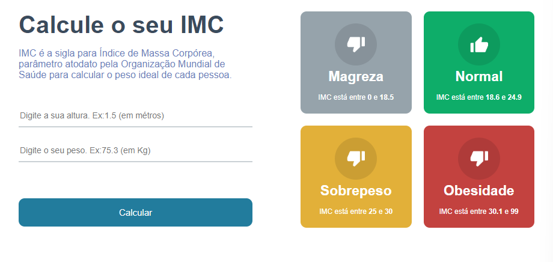

# Calculadora IMC (Índice de Massa Corporal) 📱

Segundo site, [wikipedia](https://pt.wikipedia.org/wiki/%C3%8Dndice_de_massa_corporal).
O índice de massa corporal (IMC) é uma medida internacional usada para calcular se uma pessoa está no peso ideal. Desenvolvido pelo polímata Lambert Quételet no fim do século XIX, trata-se de um método fácil e rápido para a avaliação do nível de gordura de cada pessoa, sendo, por isso, um preditor internacional de obesidade adotado pela Organização Mundial da Saúde (OMS).

  

## 💻 Tecnologias

- [React](https://pt-br.reactjs.org/)
- [Typescript](https://www.typescriptlang.org/)


## 🗂 Executar Projeto.

```bash
# Clonar Projeto
$ git clone https://github.com/PedroIzaiasSilva/Calculadora-IMC.git
# Baixar as dependencies.
$ npm install
# executar projeto.
$ npm run start 
  ```
